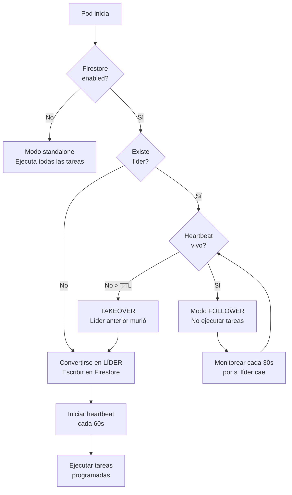

# 🔄 Multi-Pod Coordination - Leader Election System

## 📋 Problema Original

En un entorno **multi-pod** con **múltiples réplicas** en GKE, cada pod ejecutaba independientemente:

- ✅ `actualizar_menus()` - Actualiza menús de Telegram cada 10 minutos
- ✅ `guardar_noticias_forex_diarias()` - Guarda noticias diariamente a medianoche
- ✅ `guardar_datos_historicos_diarios()` - Guarda datos históricos diariamente

### ❌ Consecuencias:

Si tienes **3 pods** → cada tarea se ejecuta **3 veces** simultáneamente:
- 📱 **3x solicitudes al API de Telegram** (riesgo de rate limiting)
- 💾 **3x operaciones de GCS** (escrituras duplicadas)
- 🔥 **3x uso de CPU/memoria** innecesario
- ⚠️ Posible corrupción de datos por writes concurrentes

---

## ✅ Solución: Leader Election con Firestore

Solo **1 pod "líder"** ejecuta las tareas programadas. Los demás pods son "followers" en standby.

### Arquitectura

```
┌─────────────────────────────────────────────────────────────┐
│                     Firestore Database                      │
│                                                             │
│  Document: system/scheduler_leader                         │
│  {                                                          │
│    "pod_id": "markettool-abc123",                          │
│    "heartbeat_utc": "2026-02-11T15:30:00Z",                │
│    "elected_at_utc": "2026-02-11T15:00:00Z",               │
│    "ttl_seconds": 180                                       │
│  }                                                          │
└─────────────────────────────────────────────────────────────┘
                           ↑
          ┌────────────────┼────────────────┐
          │                │                │
     ┌────▼───┐       ┌────▼───┐      ┌────▼───┐
     │ Pod A  │       │ Pod B  │      │ Pod C  │
     │ LEADER │       │FOLLOWER│      │FOLLOWER│
     │   ✅   │       │   ⏸️   │      │   ⏸️   │
     └────────┘       └────────┘      └────────┘
     
     Ejecuta:         Espera:         Espera:
     - Menús          - Monitorea     - Monitorea
     - Noticias       - Listo para    - Listo para
     - Históricos       takeover        takeover
     
     Heartbeat: 💓 cada 60s
```

### Flujo de Elección



---

## 🔧 Implementación

### 1. Clase `PodLeaderCoordinator`

**Ubicación:** `MarketTool.py` líneas ~5372-5580

**Funcionalidades:**

| Método | Descripción |
|--------|-------------|
| `try_become_leader()` | Intenta convertirse en líder (elección) |
| `start_heartbeat()` | Inicia heartbeat periódico (60s) |
| `should_run_scheduled_task()` | Verifica si debe ejecutar tarea |
| `release_leadership()` | Libera liderazgo (shutdown graceful) |

### 2. Modificaciones en Tareas Programadas

#### `programar_actualizacion_menus()` (línea ~14602)

```python
def actualizar():
    # ✅ Multi-pod coordination: Solo el líder ejecuta
    if not _POD_COORDINATOR.should_run_scheduled_task("actualizar_menus"):
        return
    
    asyncio.run_coroutine_threadsafe(actualizar_menus(application), loop)
```

#### `guardar_noticias_forex_diarias()` (línea ~15052)

```python
async def guardar_noticias_forex_diarias():
    while True:
        await asyncio.sleep(tiempo_para_guardar)
        
        # ✅ Multi-pod coordination: Solo el líder ejecuta
        if _POD_COORDINATOR.should_run_scheduled_task("guardar_noticias_forex"):
            await guardar_noticias_forex()
```

#### `guardar_datos_historicos_diarios()` (línea ~15073)

```python
async def guardar_datos_historicos_diarios():
    while True:
        await asyncio.sleep(tiempo_para_guardar)
        
        # ✅ Multi-pod coordination: Solo el líder ejecuta
        if _POD_COORDINATOR.should_run_scheduled_task("guardar_datos_historicos"):
            await guardar_datos_historicos()
```

### 3. Inicialización en `initialize_bot()` (línea ~15032)

```python
# ✅ Multi-pod coordination: Inicializar leader election
logger.info("[MultiPod] Initializing pod coordinator...")
await _POD_COORDINATOR.try_become_leader()

# Iniciar heartbeat si es líder
loop = asyncio.get_event_loop()
await _POD_COORDINATOR.start_heartbeat(loop)
```

---

## 🔐 Firestore Schema

### Collection: `system`
### Document: `scheduler_leader`

```json
{
  "pod_id": "markettool-7d8f9-abc12",
  "heartbeat_utc": "2026-02-11T15:30:00.123456+00:00",
  "elected_at_utc": "2026-02-11T15:00:00.000000+00:00",
  "ttl_seconds": 180,
  "previous_leader": "markettool-old-pod",       // Si hubo takeover
  "takeover_reason": "Leader timeout after 185s" // Si hubo takeover
}
```

### Campos

| Campo | Tipo | Descripción |
|-------|------|-------------|
| `pod_id` | string | Hostname del pod líder actual |
| `heartbeat_utc` | string (ISO 8601) | Último heartbeat del líder |
| `elected_at_utc` | string (ISO 8601) | Timestamp cuando fue electo |
| `ttl_seconds` | int | Tiempo máximo sin heartbeat (default: 180s) |
| `previous_leader` | string (opcional) | Pod líder anterior si hubo takeover |
| `takeover_reason` | string (opcional) | Razón del takeover |

---

## 🌐 API Endpoints

### 1. **GET `/api/pod/status`**

Retorna el estado del pod actual.

**Request:**
```bash
curl http://pod-ip:8080/api/pod/status
```

**Response:**
```json
{
  "pod_id": "markettool-7d8f9-abc12",
  "is_leader": true,
  "firestore_enabled": true,
  "ttl_seconds": 180,
  "heartbeat_interval": 60
}
```

### 2. **GET `/api/pod/leader`**

Retorna información del líder actual del cluster.

**Request:**
```bash
curl http://any-pod:8080/api/pod/leader
```

**Response:**
```json
{
  "current_leader": "markettool-7d8f9-abc12",
  "heartbeat_utc": "2026-02-11T15:30:00Z",
  "elected_at_utc": "2026-02-11T15:00:00Z",
  "seconds_since_heartbeat": 15.3,
  "is_alive": true,
  "ttl_seconds": 180
}
```

### 3. **POST `/api/pod/release-leadership`**

Fuerza la liberación del liderazgo (solo desde el pod líder).

**Request:**
```bash
curl -X POST http://leader-pod:8080/api/pod/release-leadership
```

**Response:**
```json
{
  "success": true,
  "message": "Leadership released by pod markettool-abc123",
  "timestamp_utc": "2026-02-11T15:35:00Z"
}
```

---

## ⚙️ Variables de Entorno

### Configuración del Coordinator

```bash
# Habilitar Firestore (requerido para multi-pod)
FIRESTORE_ENABLED=true

# TTL del líder (segundos sin heartbeat antes de ser reemplazado)
LEADER_TTL_SECONDS=180  # Default: 3 minutos

# Intervalo de heartbeat (segundos entre cada heartbeat)
LEADER_HEARTBEAT_SECONDS=60  # Default: 1 minuto
```

### Deployment YAML (GKE)

```yaml
apiVersion: apps/v1
kind: Deployment
metadata:
  name: markettool
spec:
  replicas: 3  # Múltiples pods
  template:
    spec:
      containers:
      - name: markettool
        image: gcr.io/my-project/markettool:latest
        env:
        - name: FIRESTORE_ENABLED
          value: "true"
        - name: LEADER_TTL_SECONDS
          value: "180"
        - name: LEADER_HEARTBEAT_SECONDS
          value: "60"
```

---

## 📊 Monitoreo y Logs

### Logs Esperados

#### Pod se convierte en líder:
```
[PodCoordinator] ✅ Elected as LEADER (no previous leader)
[PodCoordinator] Heartbeat started (interval=60s)
[PodCoordinator] 💓 Heartbeat sent
```

#### Pod detecta que no es líder:
```
[PodCoordinator] ❌ NOT leader. Current leader: 'markettool-abc123' (last heartbeat 30s ago)
[PodCoordinator] ⏭️ Skipping 'actualizar_menus' (not leader)
```

#### Takeover (líder anterior murió):
```
[PodCoordinator] ⚠️ TAKEOVER: Previous leader 'markettool-old' timeout (185s > 180s)
[PodCoordinator] ✅ Elected as LEADER (takeover)
```

### Consultar estado en tiempo real

```bash
# Desde cualquier pod del cluster
kubectl exec -it markettool-abc123 -- curl localhost:8080/api/pod/leader

# Desde fuera del cluster (con ingress)
curl https://markettool.example.com/api/pod/leader
```

---

## 🔍 Troubleshooting

### Problema: Múltiples pods ejecutan la misma tarea

**Síntoma:**
```
[2026-02-11 15:30:00] [Pod A] ✅ Actualización de menús finalizada
[2026-02-11 15:30:00] [Pod B] ✅ Actualización de menús finalizada
[2026-02-11 15:30:00] [Pod C] ✅ Actualización de menús finalizada
```

**Diagnóstico:**
```bash
# Verificar si Firestore está habilitado
kubectl logs markettool-abc123 | grep "firestore_enabled"
# Esperado: firestore_enabled=true

# Verificar si hay líder
curl http://pod:8080/api/pod/leader
```

**Solución:**
1. Asegurar `FIRESTORE_ENABLED=true` en deployment
2. Verificar credenciales de Firestore en el pod
3. Revisar permisos de Firestore (read/write en collection `system`)

---

### Problema: Ningún pod ejecuta tareas

**Síntoma:**
```
[2026-02-11 15:30:00] [Pod A] ⏭️ Skipping 'actualizar_menus' (not leader)
[2026-02-11 15:30:00] [Pod B] ⏭️ Skipping 'actualizar_menus' (not leader)
[2026-02-11 15:30:00] [Pod C] ⏭️ Skipping 'actualizar_menus' (not leader)
```

**Diagnóstico:**
```bash
# Verificar si hay líder
curl http://any-pod:8080/api/pod/leader
# Si retorna 404: No hay líder electo
```

**Solución:**
1. Revisar logs de error en Firestore connection
2. Verificar documento `system/scheduler_leader` en Firestore console
3. Si está corrupto, eliminarlo manualmente:
   ```bash
   gcloud firestore documents delete projects/MY_PROJECT/databases/(default)/documents/system/scheduler_leader
   ```
4. Reiniciar pods para re-elección:
   ```bash
   kubectl rollout restart deployment/markettool
   ```

---

### Problema: Heartbeat falla (líder queda "zombie")

**Síntoma:**
```
[PodCoordinator] Heartbeat error: [Errno 111] Connection refused
[PodCoordinator] ❌ NOT leader. Current leader: 'markettool-old' (last heartbeat 185s ago)
```

**Diagnóstico:**
```bash
# Verificar si hay líder zombie
curl http://any-pod:8080/api/pod/leader
# Si "seconds_since_heartbeat" > TTL y "is_alive" = false → zombie
```

**Solución:**
1. Esperar TTL (180s) para que otro pod haga takeover automático
2. O forzar takeover manual eliminando el documento:
   ```bash
   curl -X POST http://current-leader:8080/api/pod/release-leadership
   ```

---

## 🚀 Ventajas del Sistema

| Aspecto | Antes (sin coordinación) | Después (con leader election) |
|---------|--------------------------|-------------------------------|
| **Solicitudes API Telegram** | 3x por tarea (duplicadas) | 1x por tarea (eficiente) |
| **Riesgo de rate limiting** | Alto | Eliminado |
| **Writes a GCS** | 3x concurrentes | 1x secuencial |
| **CPU/memoria** | 3x uso | 1x uso (+ overhead mínimo) |
| **Corrupción de datos** | Posible | Eliminada |
| **Tolerancia a fallos** | ❌ No | ✅ Failover automático |
| **Escalabilidad horizontal** | Problemática | ✅ Segura |

---

## 🔄 Failover Automático

### Escenario: Líder se crashea

```
Tiempo | Pod A (líder) | Pod B (follower) | Pod C (follower)
-------|---------------|------------------|-----------------
T+0s   | 💓 Heartbeat  | Esperando        | Esperando
T+60s  | 💓 Heartbeat  | Esperando        | Esperando
T+120s | 💀 CRASH      | Esperando        | Esperando
T+180s | (muerto)      | Detecta timeout  | Detecta timeout
T+181s | (muerto)      | ✅ TAKEOVER      | ⏭️ Pierde race
T+182s | (muerto)      | 💓 Heartbeat     | Detecta nuevo líder
T+242s | (muerto)      | 💓 Heartbeat     | Esperando
```

**Tiempo total sin ejecutar tareas:** ~60s (entre último heartbeat y takeover)

**Efecto en usuarios:** Ninguno (procesos periódicos tienen ventanas amplias)

---

## 📈 Índices Firestore Recomendados

Para optimizar queries de leader election:

```bash
# Collection: system
# Document: scheduler_leader

# No requiere índices adicionales (queries simples por document ID)
# Firestore optimiza automáticamente get() y update() por document path
```

---

## 🔐 Permisos Requeridos

### Service Account (GKE Workload Identity)

```yaml
# Firestore permissions requeridas
roles/datastore.user  # Read/write access a Firestore

# O permisos granulares
permissions:
  - datastore.entities.get
  - datastore.entities.create
  - datastore.entities.update
  - datastore.entities.delete
```

### Testing Local (sin Firestore)

```bash
# Deshabilitar Firestore para testing local
export FIRESTORE_ENABLED=false

# Comportamiento: Cada proceso ejecuta sus propias tareas (modo standalone)
```

---

## 📚 Referencias

- [Firestore Security Rules](https://firebase.google.com/docs/firestore/security/get-started)
- [GKE Workload Identity](https://cloud.google.com/kubernetes-engine/docs/how-to/workload-identity)
- [Leader Election Patterns](https://en.wikipedia.org/wiki/Leader_election)

---

**Status:** ✅ Implementado  
**Versión:** 1.0  
**Última actualización:** 11 de Febrero, 2026
